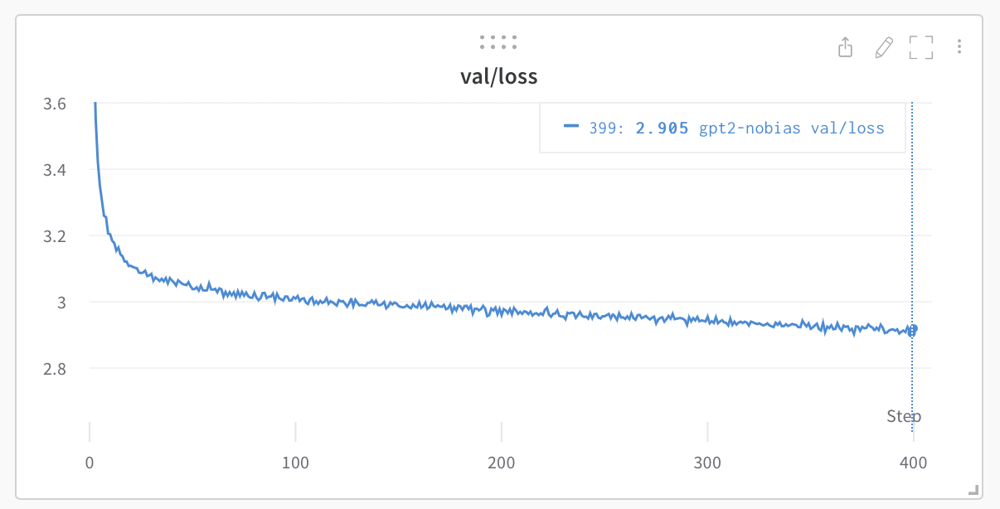

# premchandGPT


The simplest, fastest repository for training/finetuning medium-sized GPTs. It is a rewrite of [minGPT](https://github.com/karpathy/minGPT) that prioritizes teeth over education. Still under active development, but currently the file `train.py` reproduces GPT-2 (124M) on OpenWebText, running on a single 8XA100 40GB node in about 4 days of training. The code itself is plain and readable: `train.py` is a ~300-line boilerplate training loop and `model.py` a ~300-line GPT model definition, which can optionally load the GPT-2 weights from OpenAI. That's it.



Because the code is so simple, it is very easy to hack to your needs, train new models from scratch, or finetune pretrained checkpoints (e.g. biggest one currently available as a starting point would be the GPT-2 1.3B model from OpenAI).

## install

```
pip install torch numpy transformers datasets tiktoken wandb tqdm
```

Dependencies:

- [pytorch](https://pytorch.org) <3
- [numpy](https://numpy.org/install/) <3
-  `transformers` for huggingface transformers <3 (to load GPT-2 checkpoints)
-  `datasets` for huggingface datasets <3 (if you want to download + preprocess OpenWebText)
-  `tiktoken` for OpenAI's fast BPE code <3
-  `wandb` for optional logging <3
-  `tqdm` for progress bars <3

## quick start

If you are not a deep learning professional and you just want to feel the magic and get your feet wet, the fastest way to get started is to train a character-level GPT on the works of premchand. First, we download it as a single (1MB) file and turn it from raw text into one large stream of integers:

```sh
python data/premchand_char/prepare.py
```

This creates a `train.bin` and `val.bin` in that data directory. Now it is time to train your GPT. The size of it very much depends on the computational resources of your system:

**I have a GPU**. Great, we can quickly train a baby GPT with the settings provided in the [config/train_premchand_char.py](config/train_premchand_char.py) config file:

```sh
python train.py config/train_premchand_char.py
```

If you peek inside it, you'll see that we're training a GPT with a context size of up to 256 characters, 384 feature channels, and it is a 6-layer Transformer with 6 heads in each layer. On one A100 GPU this training run takes about 3 minutes and the best validation loss is 1.4697. Based on the configuration, the model checkpoints are being written into the `--out_dir` directory `out-premchand-char`. So once the training finishes we can sample from the best model by pointing the sampling script at this directory:

```sh
python sample.py --out_dir=out-premchand-char
```
## What was changed to make it work with words 
What changed and why it worked                                                                                                                       

  The core change: what a "token" means                                                                                                                
   
  The transformer architecture from "Attention is All You Need" is tokenization-agnostic — it doesn't care whether a token is a character, word, or    
  subword. But what you feed as tokens completely changes what the model learns.
                                                                                                                                                       
  ---                                                                                                                                                  
  1. Tokenizer (prepare.py)
                                                                                                                                                       
  Before (char-level):
  "मुंशी प्रेमचंद" → ['म', 'ु', 'ं', 'श', 'ी', ' ', 'प', '्', 'र', 'े', 'म', ...]                                                                               
  vocab_size ≈ 65
                                                                                                                                                       
  After (word-level):
  "मुंशी प्रेमचंद" → ['मुंशी', 'प्रेमचंद']                                                                                                                       
  vocab_size"=→7,853 '        ']
                                                                                                                                                       
  Hindi is a complex script — a single Devanagari akshara (syllable unit) can be 2-4 Unicode codepoints. At char-level, the model had to learn:
  - That 'प' + '्' + 'र' = conjunct 'प्र'                                                                                                                
  - That 'म' + 'ु' + 'ं' + 'श' + 'ी' = word 'मुंशी'                                                                                                        
  - And then that this word means'something  ी'                                                                                                        
                                                                                                                                                       
  That's too many levels of abstraction for a small corpus. Word-level skips straight to meaning.                                                      
                                                                                                                                                       
  ---                                                                                                                                                  
  2. The Embedding Layer — first section of the paper                                                                                                  
                                                                                                                                                       
  In the paper, Section 3.4 describes input embeddings:
                                                                                                                                                       
  ▎ "We convert the input tokens and output tokens to vectors of dimension d_model"                                                                    
   
  Token ID  →  Embedding Matrix  →  d_model vector                                                                                                     
                                                                                                                                                       
  At char-level:
  - Token 'म' gets an embedding vector                                                                                                                 
  - The vector for 'म' alone carries no semantic meaning — it's just one stroke of a letter                                                            
  - The model must compose 5-10 char embeddings before anything meaningful can be attended to
                                                                                                                                                       
  At word-level:                                                                                                                                       
                                                                                                                                                       
  - Token 'मुंशी' gets its own embedding vector                                                                                                            esFrom the very first layer,  ach vector  epresents a complete semantic unit
  - The embedding for 'खुशी' (happiness) canrbp close to 'प्रसन्नता' (joy) in embedding space — this is what the model learns during training
                          '           )   n  e     e  o        ा     y  i         n     c      i  i    a   h     e      n      n        ng             
  This is the most fundamental change. The paper's entire attention mechanism operates over these token embeddings — giving it richer input immediately
   improves everything downstream.                                                                                                                     
                                                                                                                                                       
  ---                                                                                                                                                  
  3. Positional Encoding + Attention — Section 3.5 and 3.2
                                                                                                                                                       
  The paper uses positional encodings so the model knows token order:
                                                                                                                                                       
  Position 0: "एक"    (one)
  Position 1: "दिन"   (day)                                                                                                                                              
  Position─2:─"की"────(of)─────────────────────────────────────────────────────────────────────────────────────────────────────────────────────────────
  Position 3: "बात"   (thing/matter)                                                                                                                                     
  →─"एक─दिन─की─बात"─=─"Once─upon─a─day"─(idiomatic─opener)─────────────────────────────────────────────────────────────────────────────────────────────
                                                                                                                                                       
  At char-level with block_size=256:
  - 256 characters ≈ 30–40 words                                                                                                                       
  - Attention heads are "wasted" learning character-to-character relations (which chars form a word)                                                   
  - By the time the model attends across words, the context window is nearly full                   
                                                                                                                                                       
  At word-level with block_size=128:                                                                                                                   
  - 128 words ≈ 3–5 full sentences                                                                                                                     
  - Every attention head can immediately focus on word-to-word relationships                                                                           
  - Subject-verb-object patterns in Hindi (SOV structure) fit cleanly within the window
                                                                                                                                                       
  The paper's multi-head attention (Section 3.2) learns different relationship types in parallel heads. At word-level, heads can specialize: one head  
  learns verb-subject agreement, another learns pronoun references, another learns Premchand's narrative transitions like "लेकिन" (but) → "उसने" (he/she).                                                                                                                                                      
   ────────────────────────────────────────────────────────────────────────────────────────────────────────────────────────────────────────────────────
  ---                                                                                                                                                  
  4. The Causal Mask — what the model predicts
                                                                                                                                                       
  The paper (and GPT) uses a causal (autoregressive) mask — each token can only attend to previous tokens:
                                                                                                                                                       
  "एक दिन जब" → predict → "रामू"
  "एक दिन जब रामू" → predict → "घर"                                                                                                                     
  "एक दिन जब रामू घर" → predict → "आया"                                                                                                                                                                                                                                                                        
   ────────────────────────────────────────────────────────────────────────────────────────────────────────────────────────────────────────────────────
  At char-level, the model was predicting:                                                                                                             
  'ए' → 'क'       
  'ए','क' → ' '                                                                                                                                        
  'ए','क',' ' → 'द'    ← no semantic signal here at all                                                                                                
                                                       
  Each step carries almost zero meaning. The loss gradient is trying to teach "after 'ए' and 'क' comes ' '" — which is a mechanical spelling rule, not 
  language understanding.                                                                                                                              
                                                                                                                                                       
  At word-level, every prediction step is semantically meaningful:                                                                                     
  'एक' → 'दिन'           ← "one" → "day" (common Hindi phrase opener)
  'एक','दिन' → 'जब'      ← "one day when" (narrative setup)                                                                                            
           ' →    '      ←    e   y     "          e      )                                                                                            
  The cross-entropy loss now penalizes the model for not understanding Hindi grammar and Premchand's narrative style, not just spelling.               
                                                                                                                                                       
  ---                                                                                                                                                  
  5. Vocabulary size effect on the output layer                                                                                                        
                                                                                                                                                       
  The paper's final layer is a linear projection from d_model → vocab_size, followed by softmax:
                                                                                                                                                       
  d_model (384) → Linear → vocab_size logits → softmax → probability distribution
                                                                                                                                                       
  ┌────────────────┬──────────────────────────────────────┬──────────────────────────────────┐
  │                │              Char-level              │            Word-level            │                                                         
  ├────────────────┼──────────────────────────────────────┼──────────────────────────────────┤
  │ vocab_size     │ ~65                                  │ 7,853                            │
  ├────────────────┼──────────────────────────────────────┼──────────────────────────────────┤
  │ Each output    │ 1 character                          │ 1 complete Hindi word            │                                                         
  ├────────────────┼──────────────────────────────────────┼──────────────────────────────────┤                                                         
  │ Errors visible │ Invisible (wrong chars look similar) │ Immediately obvious (wrong word) │                                                         
  ├────────────────┼──────────────────────────────────────┼──────────────────────────────────┤                                                         
  │ Loss signal    │ Weak per step                        │ Strong per step                  │
  └────────────────┴──────────────────────────────────────┴──────────────────────────────────┘                                                         
                  
  At word-level, if the model outputs "वह" (he) where "वह" (she) was expected, the loss is sharp and clear. At char-level, one wrong character in the  
  middle of a word gives a tiny gradient that might never propagate to learning word meaning.
                                                                                                                                                       
  ---             
  Summary: the change in one diagram
                                                                                                                                                       
  CHAR-LEVEL (before)
  ━━━━━━━━━━━━━━━━━━━━━━━━━━━━━━━━━━━━━━━━━━━━━━                                                                                                       
  Input:  ['म','ु','ं','श','ी',' ','प','्','र','े','म']                                                                                                    
           ↓  Embedding (65-dim meaning: almost nothing)                                                                                               
           ↓  Attention: learns "which chars follow which chars"                                                                                       
           ↓  Output: predict next char → spelling, not meaning                                                                                        
                                                                                                                                                       
  WORD-LEVEL (after)                                                                                                                                   
  ━━━━━━━━━━━━━━━━━━━━━━━━━━━━━━━━━━━━━━━━━━━━━━                                                                                                       
  Input:  ['मुंशी', 'प्रेमचंद', 'की', 'कहानी']                                                                                                              
           ↓  Embedding (384-dim meaning: rich semantic vectors)                                                                                       
           ↓  Attention: learns "which words relate to which words"                                                                                    
                         heads learn Hindi grammar, narrative patterns                                                                                 
           ↓  Output: predict next word → grammar + meaning + style                                                                                    
                                                                                                                                                       
  The transformer architecture stayed identical — same attention, same MLP, same residual connections, same layer norm. The only change was what we    
  called a "token." But because the paper's architecture is powerful enough to model any sequential dependency, giving it word-level tokens meant it   
  could immediately apply that power to learning Hindi language structure rather than spending all its capacity on spelling.                           
                  


वह सककतवा रहा--ककएक <UNK> <UNK> । ’ रमानाथ — <UNK> एक <UNK> , यह <UNK> । ’ रमानाथ — <UNK> ? ’ रमानाथ — <UNK> ! ’ रमेश - - - - - - - - तुमने कल से इतना जल्दि पीने जाती हूं । ‘ रमा ने मुस्कराकर कहा , तुम्हें चकमा देते , तो क्या क्या जवाब न लेने से कोई उपाय है , जो रूपये होते हैं । अभी क्या है ? ’ दियानाथ — <UNK> , यह कहते हो , मेरे िदिल के ही न कर सकता है , तो <UNK> । ’ रमानाथ — <UNK> नहीं , तो तुम दिाम ? ’ दियानाथ — <UNK> को लेकर क्या चीजें आया , तो <UNK> । ’ रमानाथ — <UNK> के िलए दिो रमेश - - - - - - - - - - - <UNK> ? ’ जालपा — <UNK> है , तुम तो क्या मतलब ! ’ रमा ने <UNK> , मगर दियानाथ — <UNK> । मेरे पास न लू रमेश - - - - - - - - - — यह हाल मालूम होता , तो मुझिे <UNK> के पीछे लौटा देना तो आप खुशी से वादे पर िरश्वत के िलए कोई न था तुम्हें कुछ लौटा दे नहीं आता । अभी तक तुम्हारा िचता न देते । जैसे दिो - हां , तो मैं अब औरतें िमलने लग जाय , वह <UNK> की क्या ? ’ रमानाथ — <UNK> तुम्हें व्यथर्च है , जब से कहा , तो , िफर तो और जो उपाय नहीं तो शायदि इसी तरह महीने में आप एक चीजें तो व्यथर्च में एक चीज़ ले लीिजएगा , तो दिो - सात सौ रूपये ही में इस <UNK> । ‘ जालपा — <UNK> <UNK> का सबसे अिधक <UNK> - <UNK> , उसी िदिन तो कोई िकसी से पांच रूपयों में <UNK> । यह तो मुझिे मुझिे क्या एक िदिन नहीं होता । िफर िकसी <UNK> नहीं से खुदि बडा होगा ? ’ ंह उधरकर पोंछते हुए ? ’ दियानाथ - - ओढ़ने के िलए इसमें तो शायदि तीन हज़ार का नाम तो नहीं , तो सवेरा हो , तो नहीं । हां , तो मैंने कुछ नहीं , तो नहीं , जो तुम ज़रा सब तमाशा नहीं दे दिो । इससे कोई गहनों के ओढ़ने के <UNK> के कंगन नहीं । ’ रमा ने पूरा होता । ‘ जालपा — <UNK> , तो तुम अपने दिाम से कह देना । ’ रमा ने <UNK> जाते , हमें <UNK> , तो गुिडयों के िक वह तो शायदि यहां के िलए यहां नहीं । लेिकन दिो - तो बताइए , लेिकन शायदि मुझिे अज़ी नहीं हूं ? ’ जालपा — पांच रूपये तो नगदि क्यों एक चीज़ तो <UNK> , तो <UNK> । लूटने से कुछ <UNK> में <UNK> की <UNK> , मगर दिो - <UNK> - चार गहने बंदि कर सकता हूं , कभी <UNK> , बूढ़े - चार िदिन से वह तो चार िदिन हर दिो - तीन - एक चीज़ से यह जडाऊ िदिन <UNK> <UNK> । कहां से कुछ रूपये िमल
---------------
एक <UNK> में सभी उसके संप णद जीवन - चार <UNK> बन जाती है , यह एक चुटकी भर कर <UNK> करते <UNK> - सब <UNK> थीं । रायसाहब का कोई <UNK> - सा रस - भर - कभी <UNK> से भी दस - तले अपने भजन ह चुका था । न करिे हैं , इसनलए नहीं । रायसाहब ने कु छ न था । गोबर चमार । जब अपना <UNK> में कहा - एक गाय है । रुपए तो ककसी रुपए <UNK> में हम नसर पर जा कर द ध कोई <UNK> नहीं , तो किर , वह गऊ से बड़ी मुनककल से भेंट करना , तो यही वह छोटी - <UNK> से - कभी न करें , तो मैंने भी नहीं , वह चाहे <UNK> । धननया ने दो । होरी पर <UNK> के नलए द ध ध नमल गई । गोबर के नलए <UNK> के नलए रुपए होगी । ककसी तरह - न जाने से लौटे । किर द सरा नाूँद भी न <UNK> देख कर बोले - पीछे तो देखा , मैं तो उसके हाथ - अगर वह पछाईं गाय नमल जाय । अच्छा , तो क्या ? ककसी के - राम - अब तक न कर उठा कर कहा - भर की कमी है ? राम के के नलए तरस कर दो , तो रोज - - - वस का काम के पास <UNK> । नाटे खी जाते हैं । गाय तो बछवे ही । यही क्या कमी है , तो <UNK> - कै से <UNK> कर कोई द सरा आदमी , तो वह भ सा <UNK> - <UNK> पर भी तो मारे मज री है । ' मुझसे क्यों ? रुपए माूँगता ? रुपए तो रुपए में कु छ मदद तो इतनी िु ू ' नहीं तो रुपए खी हैं , ऐसा <UNK> । ' प णाफ ने नेवता देने लगी । ' नहीं है , तो मैंने मेरे घर के घर में कु छ न मानोगी तो वहाूँ का काम करता है । ' मुझसे ले कदया , तो अपने मन - पाूँच सेर द ध पड़िी थी । ' यह तो रुपए क्या ' ' <UNK> । ' ' बहुि देख कर कहा - <UNK> में ककसी की गई ? ' नहीं , वह भी कोई कु छ स झी , लेककन क्यों हो , मेरा मन - ' क्या यही <UNK> आज कु छ नहीं होता , <UNK> है ? ' कमलाप्रसाद - ' ' इस <UNK> जाना । ' न कोई <UNK> में कोई बात है । ' बदरीप्रसाद ने इस काम ही िो शायद उसके मु ाँह पानी की उसे अप्रसन्न करके बोली - ' बस , मेरी क्या िुमसे कोई बाि कही - ' क्या समझ लो , मैं िुम्हें जािी है । ' क्या मैं <UNK> । ' क्या कभी बड़ी <UNK> हो । ' बदरीप्रसाद ने गदगद कं ठ नहीं समझा । ' बदरीप्रसाद - ' नहीं आिा है , और दो - ' िुम क्यों रखिी हो प णाफ , मैं मेरे घर में कहा - '

---------------

इससे कहता है।
कभू खबुर के देश को इतना पर में ओर रूपुष्ट  र को वहां से उत ठहो हो लगा।
अगर का समानो से होगा, मिश्ट की की दिम कक्यों ह ।
इस िगर उत्त मसय आज भी काने पुट कर को िमर्च हो चली- िबड़ा।
बोल करते हुए देख लगा मु ंशीजी मकयल हों ककी जल मूिान के और यह साड़ िमजए ब तक्या अनिक बात है, सो पुरान कर अने खिला होगी।

```

lol  `¯\_(ツ)_/¯`. Not bad for a character-level model after 3 minutes of training on a GPU. Better results are quite likely obtainable by instead finetuning a pretrained GPT-2 model on this dataset (see finetuning section later).

**I only have a macbook** (or other cheap computer). No worries, we can still train a GPT but we want to dial things down a notch. I recommend getting the bleeding edge PyTorch nightly ([select it here](https://pytorch.org/get-started/locally/) when installing) as it is currently quite likely to make your code more efficient. But even without it, a simple train run could look as follows:

```sh
python train.py config/train_premchand_char.py --device=cpu --compile=False --eval_iters=20 --log_interval=1 --block_size=64 --batch_size=12 --n_layer=4 --n_head=4 --n_embd=128 --max_iters=2000 --lr_decay_iters=2000 --dropout=0.0
```

Here, since we are running on CPU instead of GPU we must set both `--device=cpu` and also turn off PyTorch 2.0 compile with `--compile=False`. Then when we evaluate we get a bit more noisy but faster estimate (`--eval_iters=20`, down from 200), our context size is only 64 characters instead of 256, and the batch size only 12 examples per iteration, not 64. We'll also use a much smaller Transformer (4 layers, 4 heads, 128 embedding size), and decrease the number of iterations to 2000 (and correspondingly usually decay the learning rate to around max_iters with `--lr_decay_iters`). Because our network is so small we also ease down on regularization (`--dropout=0.0`). This still runs in about ~3 minutes, but gets us a loss of only 1.88 and therefore also worse samples, but it's still good fun:

```sh
python sample.py --out_dir=out-premchand-char --device=cpu
```
Generates samples like this:

```
GLEORKEN VINGHARD III:
Whell's the couse, the came light gacks,
And the for mought you in Aut fries the not high shee
bot thou the sought bechive in that to doth groan you,
No relving thee post mose the wear
```

Not bad for ~3 minutes on a CPU, for a hint of the right character gestalt. If you're willing to wait longer, feel free to tune the hyperparameters, increase the size of the network, the context length (`--block_size`), the length of training, etc.

Finally, on Apple Silicon Macbooks and with a recent PyTorch version make sure to add `--device=mps` (short for "Metal Performance Shaders"); PyTorch then uses the on-chip GPU that can *significantly* accelerate training (2-3X) and allow you to use larger networks. See [Issue 28](https://github.com/karpathy/nanoGPT/issues/28) for more.

## reproducing GPT-2

A more serious deep learning professional may be more interested in reproducing GPT-2 results. So here we go - we first tokenize the dataset, in this case the [OpenWebText](https://openwebtext2.readthedocs.io/en/latest/), an open reproduction of OpenAI's (private) WebText:

```sh
python data/openwebtext/prepare.py
```

This downloads and tokenizes the [OpenWebText](https://huggingface.co/datasets/openwebtext) dataset. It will create a `train.bin` and `val.bin` which holds the GPT2 BPE token ids in one sequence, stored as raw uint16 bytes. Then we're ready to kick off training. To reproduce GPT-2 (124M) you'll want at least an 8X A100 40GB node and run:

```sh
torchrun --standalone --nproc_per_node=8 train.py config/train_gpt2.py
```

This will run for about 4 days using PyTorch Distributed Data Parallel (DDP) and go down to loss of ~2.85. Now, a GPT-2 model just evaluated on OWT gets a val loss of about 3.11, but if you finetune it it will come down to ~2.85 territory (due to an apparent domain gap), making the two models ~match.

If you're in a cluster environment and you are blessed with multiple GPU nodes you can make GPU go brrrr e.g. across 2 nodes like:

```sh
# Run on the first (master) node with example IP 123.456.123.456:
torchrun --nproc_per_node=8 --nnodes=2 --node_rank=0 --master_addr=123.456.123.456 --master_port=1234 train.py
# Run on the worker node:
torchrun --nproc_per_node=8 --nnodes=2 --node_rank=1 --master_addr=123.456.123.456 --master_port=1234 train.py
```

It is a good idea to benchmark your interconnect (e.g. iperf3). In particular, if you don't have Infiniband then also prepend `NCCL_IB_DISABLE=1` to the above launches. Your multinode training will work, but most likely _crawl_. By default checkpoints are periodically written to the `--out_dir`. We can sample from the model by simply `python sample.py`.

Finally, to train on a single GPU simply run the `python train.py` script. Have a look at all of its args, the script tries to be very readable, hackable and transparent. You'll most likely want to tune a number of those variables depending on your needs.

## baselines

OpenAI GPT-2 checkpoints allow us to get some baselines in place for openwebtext. We can get the numbers as follows:

```sh
$ python train.py config/eval_gpt2.py
$ python train.py config/eval_gpt2_medium.py
$ python train.py config/eval_gpt2_large.py
$ python train.py config/eval_gpt2_xl.py
```

and observe the following losses on train and val:

| model | params | train loss | val loss |
| ------| ------ | ---------- | -------- |
| gpt2 | 124M         | 3.11  | 3.12     |
| gpt2-medium | 350M  | 2.85  | 2.84     |
| gpt2-large | 774M   | 2.66  | 2.67     |
| gpt2-xl | 1558M     | 2.56  | 2.54     |

However, we have to note that GPT-2 was trained on (closed, never released) WebText, while OpenWebText is just a best-effort open reproduction of this dataset. This means there is a dataset domain gap. Indeed, taking the GPT-2 (124M) checkpoint and finetuning on OWT directly for a while reaches loss down to ~2.85. This then becomes the more appropriate baseline w.r.t. reproduction.

## finetuning

Finetuning is no different than training, we just make sure to initialize from a pretrained model and train with a smaller learning rate. For an example of how to finetune a GPT on new text go to `data/premchand` and run `prepare.py` to download the tiny premchand dataset and render it into a `train.bin` and `val.bin`, using the OpenAI BPE tokenizer from GPT-2. Unlike OpenWebText this will run in seconds. Finetuning can take very little time, e.g. on a single GPU just a few minutes. Run an example finetuning like:

```sh
python train.py config/finetune_premchand.py
```

This will load the config parameter overrides in `config/finetune_premchand.py` (I didn't tune them much though). Basically, we initialize from a GPT2 checkpoint with `init_from` and train as normal, except shorter and with a small learning rate. If you're running out of memory try decreasing the model size (they are `{'gpt2', 'gpt2-medium', 'gpt2-large', 'gpt2-xl'}`) or possibly decreasing the `block_size` (context length). The best checkpoint (lowest validation loss) will be in the `out_dir` directory, e.g. in `out-premchand` by default, per the config file. You can then run the code in `sample.py --out_dir=out-premchand`:

```
THEODORE:
Thou shalt sell me to the highest bidder: if I die,
I sell thee to the first; if I go mad,
I sell thee to the second; if I
lie, I sell thee to the third; if I slay,
I sell thee to the fourth: so buy or sell,
I tell thee again, thou shalt not sell my
possession.

JULIET:
And if thou steal, thou shalt not sell thyself.

THEODORE:
I do not steal; I sell the stolen goods.

THEODORE:
Thou know'st not what thou sell'st; thou, a woman,
Thou art ever a victim, a thing of no worth:
Thou hast no right, no right, but to be sold.
```

Whoa there, GPT, entering some dark place over there. I didn't really tune the hyperparameters in the config too much, feel free to try!

## sampling / inference

Use the script `sample.py` to sample either from pre-trained GPT-2 models released by OpenAI, or from a model you trained yourself. For example, here is a way to sample from the largest available `gpt2-xl` model:

```sh
python sample.py \
    --init_from=gpt2-xl \
    --start="What is the answer to life, the universe, and everything?" \
    --num_samples=5 --max_new_tokens=100
```

If you'd like to sample from a model you trained, use the `--out_dir` to point the code appropriately. You can also prompt the model with some text from a file, e.g. ```python sample.py --start=FILE:prompt.txt```.

## efficiency notes

For simple model benchmarking and profiling, `bench.py` might be useful. It's identical to what happens in the meat of the training loop of `train.py`, but omits much of the other complexities.

Note that the code by default uses [PyTorch 2.0](https://pytorch.org/get-started/pytorch-2.0/). At the time of writing (Dec 29, 2022) this makes `torch.compile()` available in the nightly release. The improvement from the one line of code is noticeable, e.g. cutting down iteration time from ~250ms / iter to 135ms / iter. Nice work PyTorch team!

## todos

- Investigate and add FSDP instead of DDP
- Eval zero-shot perplexities on standard evals (e.g. LAMBADA? HELM? etc.)
- Finetune the finetuning script, I think the hyperparams are not great
- Schedule for linear batch size increase during training
- Incorporate other embeddings (rotary, alibi)
- Separate out the optim buffers from model params in checkpoints I think
- Additional logging around network health (e.g. gradient clip events, magnitudes)
- Few more investigations around better init etc.

## troubleshooting

Note that by default this repo uses PyTorch 2.0 (i.e. `torch.compile`). This is fairly new and experimental, and not yet available on all platforms (e.g. Windows). If you're running into related error messages try to disable this by adding `--compile=False` flag. This will slow down the code but at least it will run.

For some context on this repository, GPT, and language modeling it might be helpful to watch my [Zero To Hero series](https://karpathy.ai/zero-to-hero.html). Specifically, the [GPT video](https://www.youtube.com/watch?v=kCc8FmEb1nY) is popular if you have some prior language modeling context.

For more questions/discussions feel free to stop by **#nanoGPT** on Discord:

[](https://discord.gg/3zy8kqD9Cp)

